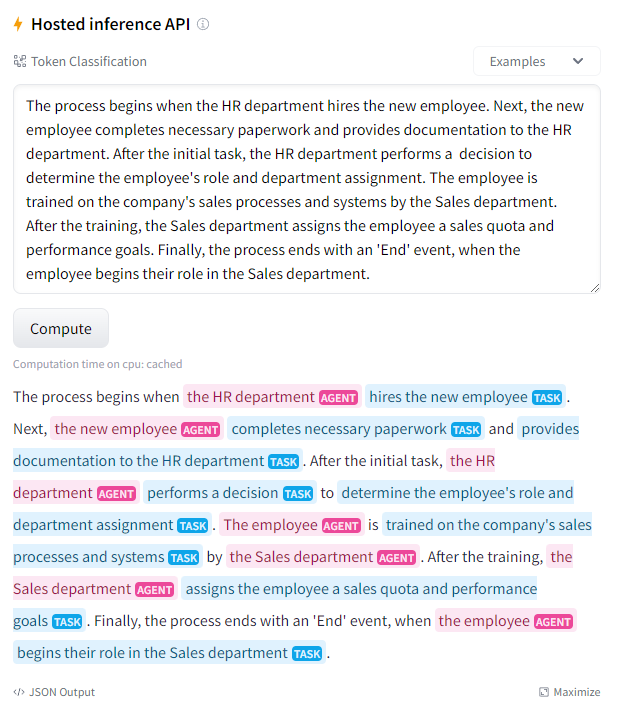

# bert-finetuned-bpmn
 
[https://huggingface.co/jtlicardo/bert-finetuned-bpmn](https://huggingface.co/jtlicardo/bert-finetuned-bpmn)
 
A BERT model fine-tuned to extract BPMN agents and tasks in a process.

---

It achieves the following results on the evaluation set:
- Loss: 0.2656
- Precision: 0.7314
- Recall: 0.8366
- F1: 0.7805
- Accuracy: 0.8939

### Training hyperparameters

The following hyperparameters were used during training:
- learning_rate: 2e-05
- train_batch_size: 8
- eval_batch_size: 8
- seed: 42
- optimizer: Adam with betas=(0.9,0.999) and epsilon=1e-08
- lr_scheduler_type: linear
- num_epochs: 5

### Training results

| Training Loss | Epoch | Step | Validation Loss | Precision | Recall | F1     | Accuracy |
|:-------------:|:-----:|:----:|:---------------:|:---------:|:------:|:------:|:--------:|
| No log        | 1.0   | 10   | 0.8437          | 0.1899    | 0.3203 | 0.2384 | 0.7005   |
| No log        | 2.0   | 20   | 0.4967          | 0.5421    | 0.7582 | 0.6322 | 0.8417   |
| No log        | 3.0   | 30   | 0.3403          | 0.6719    | 0.8431 | 0.7478 | 0.8867   |
| No log        | 4.0   | 40   | 0.2821          | 0.6923    | 0.8235 | 0.7522 | 0.8903   |
| No log        | 5.0   | 50   | 0.2656          | 0.7314    | 0.8366 | 0.7805 | 0.8939   |

### Framework versions

- Transformers 4.25.1
- Pytorch 1.13.0+cu116
- Datasets 2.7.1
- Tokenizers 0.13.2
